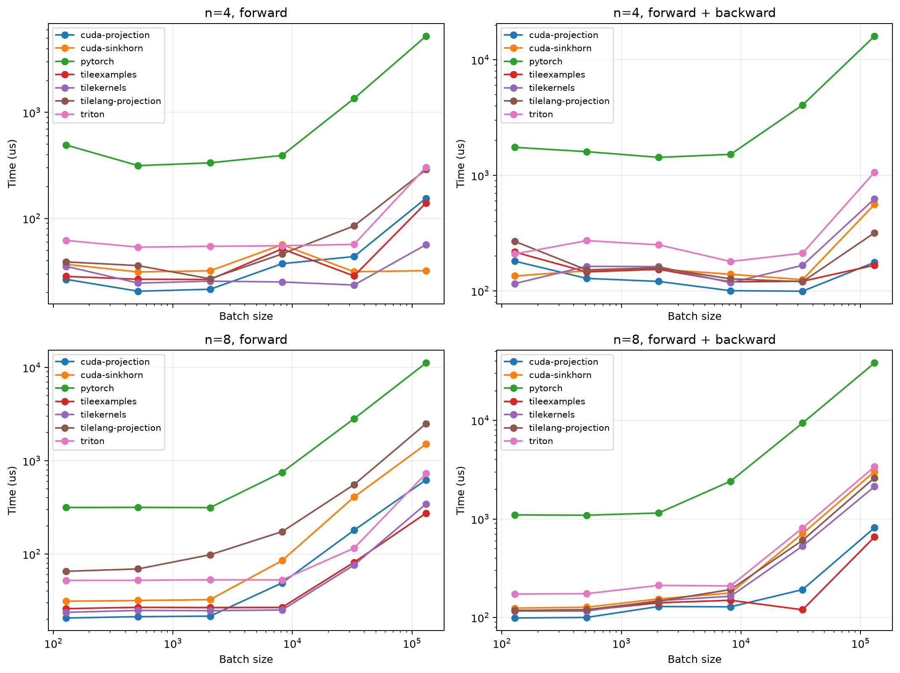

# mHC-proj

**mHC-proj** is a CUDA library that accelerates the Birkhoff projection operator in [manifold-constrained hyper-connections (mHC)](https://arxiv.org/pdf/2512.24880). The current implemention supports the expansion rate of $n=4$ in mHC, providing highly optimized CUDA kernels that output $4\times 4$ doubly stochastic matrices from unconstrained ones. Both forward and backward passes are supported. Details can be found in our paper [Accelerating Birkhoff Projection for Manifold-Constrained Hyper-Connections](https://arxiv.org/pdf/2606.07574).

## Method

This library uses a different algorithm from the Sinkhorn-Knopp method that is suggested by the [mHC paper](https://arxiv.org/pdf/2512.24880). It has the following highlights:

1. **Forward pass via Newton's method**: We reformulate the dual of the Birkhoff projection problem as an unconstrained convex optimization in $\mathbb{R}^{3}$, and derive closed-form expressions for the gradient and Hessian. This enables the use of Newton's method, which converges quadratically and typically requires far fewer iterations than Sinkhorn-Knopp.

2. **Backward pass via implicit differentiation**: Instead of backpropagating through the iterative solver, we derive an analytical expression for the derivative of the projection using the implicit function theorem. This allows us to compute gradients exactly and efficiently, without storing intermediate iterates.

3. **GPU-efficient implementation**: We design a warp-level CUDA kernel that processes two $4\times4$ matrices simultaneously using only register-level primitives. The implementation avoids shared memory and global memory I/O, achieving high throughput with minimal overhead.

## Installation

After installing CUDA-based PyTorch and setting up the CUDA development environment, enter the project directory and run:

```bash
pip3 install --no-build-isolation .
```

## PyTorch Interface

The projection operator can be accessed via the `mhc_proj.MHCProjectionN4` module:

```py
import torch
from mhc_proj import MHCProjectionN4

torch.manual_seed(123)
N = 2
x = torch.randn(N, 4, 4, device="cuda")
x.requires_grad_(True)
G = torch.randn(N, 4, 4, device="cuda")

# Vanilla PyTorch implementation of Sinkhorn-Knopp algorithm
eps = 1e-6
P = torch.exp(x)
for _ in range(20):
    P = P / (P.sum(dim=2, keepdim=True) + eps)
    P = P / (P.sum(dim=1, keepdim=True) + eps)

loss = torch.sum(G * P)
loss.backward()
print(P)
# tensor([[[0.4750, 0.1686, 0.0225, 0.3339],
#          [0.0721, 0.2143, 0.4805, 0.2332],
#          [0.4112, 0.1480, 0.0948, 0.3460],
#          [0.0418, 0.4692, 0.4022, 0.0869]],

#         [[0.2199, 0.0543, 0.5639, 0.1619],
#          [0.0451, 0.3823, 0.2175, 0.3551],
#          [0.2440, 0.2218, 0.0760, 0.4583],
#          [0.4910, 0.3416, 0.1426, 0.0247]]], device='cuda:0',
#        grad_fn=<DivBackward0>)
print(x.grad)
# tensor([[[-0.1169,  0.1423, -0.0006, -0.0248],
#          [ 0.0488,  0.1300, -0.4080,  0.2292],
#          [ 0.0912,  0.0318,  0.1050, -0.2281],
#          [-0.0231, -0.3041,  0.3035,  0.0237]],

#         [[ 0.3092, -0.0090,  0.0445, -0.3446],
#          [ 0.0898, -0.5874,  0.1496,  0.3481],
#          [-0.1448,  0.1162, -0.0220,  0.0507],
#          [-0.2541,  0.4802, -0.1720, -0.0541]]], device='cuda:0')

x.grad = None
proj = MHCProjectionN4(tol=1e-6)
P2 = proj(x)
loss2 = torch.sum(G * P2)
loss2.backward()
print(P2)
# tensor([[[0.4750, 0.1686, 0.0225, 0.3339],
#          [0.0721, 0.2143, 0.4805, 0.2332],
#          [0.4112, 0.1480, 0.0948, 0.3460],
#          [0.0418, 0.4692, 0.4022, 0.0869]],

#         [[0.2199, 0.0543, 0.5639, 0.1619],
#          [0.0451, 0.3823, 0.2175, 0.3551],
#          [0.2440, 0.2218, 0.0760, 0.4583],
#          [0.4910, 0.3416, 0.1426, 0.0247]]], device='cuda:0',
#        grad_fn=<MHCProjectionN4FunctionBackward>)
print(x.grad)
# tensor([[[-0.1169,  0.1423, -0.0006, -0.0248],
#          [ 0.0488,  0.1300, -0.4080,  0.2292],
#          [ 0.0912,  0.0318,  0.1050, -0.2281],
#          [-0.0231, -0.3041,  0.3035,  0.0237]],

#         [[ 0.3092, -0.0090,  0.0445, -0.3446],
#          [ 0.0898, -0.5874,  0.1496,  0.3481],
#          [-0.1448,  0.1162, -0.0220,  0.0507],
#          [-0.2541,  0.4802, -0.1720, -0.0541]]], device='cuda:0')
```

One can also use the lower-level functions

- `mhc_proj.torch.birkhoff_proj_n4(R, tol=1e-6)`
- `mhc_proj.torch.birkhoff_proj_n4_backward(G, T)`

to accomplish the forward and backward passes:

```py
import torch
import mhc_proj

torch.manual_seed(123)
N = 2
x = torch.randn(N, 4, 4, device="cuda")
G = torch.randn(N, 4, 4, device="cuda")

P3 = mhc_proj.torch.birkhoff_proj_n4(x, tol=1e-6)["T"]
print(P3)
# tensor([[[0.4750, 0.1686, 0.0225, 0.3339],
#          [0.0721, 0.2143, 0.4805, 0.2332],
#          [0.4112, 0.1480, 0.0948, 0.3460],
#          [0.0418, 0.4692, 0.4022, 0.0869]],

#         [[0.2199, 0.0543, 0.5639, 0.1619],
#          [0.0451, 0.3823, 0.2175, 0.3551],
#          [0.2440, 0.2218, 0.0760, 0.4583],
#          [0.4910, 0.3416, 0.1426, 0.0247]]], device='cuda:0')
D3 = mhc_proj.torch.birkhoff_proj_n4_backward(G, P3)["D"]
print(D3)
# tensor([[[-0.1169,  0.1423, -0.0006, -0.0248],
#          [ 0.0488,  0.1300, -0.4080,  0.2292],
#          [ 0.0912,  0.0318,  0.1050, -0.2281],
#          [-0.0231, -0.3041,  0.3035,  0.0237]],

#         [[ 0.3092, -0.0090,  0.0445, -0.3446],
#          [ 0.0898, -0.5874,  0.1496,  0.3481],
#          [-0.1448,  0.1162, -0.0220,  0.0507],
#          [-0.2541,  0.4802, -0.1720, -0.0541]]], device='cuda:0')
```

## Benchmark

The benchmark uses the seven implementation names defined in the paper for both
$n=4$ and $n=8$:

1. **Vanilla**: A direct Sinkhorn–Knopp implementation in PyTorch.
2. **Triton-Sinkhorn**: The fused implementation adapted from [triton-sinkhorn](https://github.com/LottoLottoLotto/triton-sinkhorn).
3. **mHC.cu**: The specialized CUDA Sinkhorn–Knopp implementation.
4. **TileLangExamples**: The Sinkhorn–Knopp implementation adapted from the TileLang examples.
5. **TileKernels**: The Sinkhorn–Knopp implementation adapted from DeepSeek TileKernels.
6. **mHC-proj-TL**: The proposed second-order projection solver implemented in TileLang.
7. **mHC-proj**: The proposed second-order projection solver implemented in CUDA.

Install the optional plotting dependency, run the benchmark, and render the plot with:

```bash
uv sync --group benchmark
uv run python benchmark/run.py
uv run python benchmark/plot.py
```

The runner records forward and forward-plus-backward latency alongside the doubly stochastic marginal error

$$
\mathrm{Err}(T_i)=\Vert T_i\mathbf{1}_n-\mathbf{1}_n \Vert_1 + \Vert T_i^\top\mathbf{1}_n-\mathbf{1}_n \Vert_1.
$$

Results are stored in `results/benchmarks/results.csv`, and the plot is written to `results/benchmarks/benchmark.png`.


